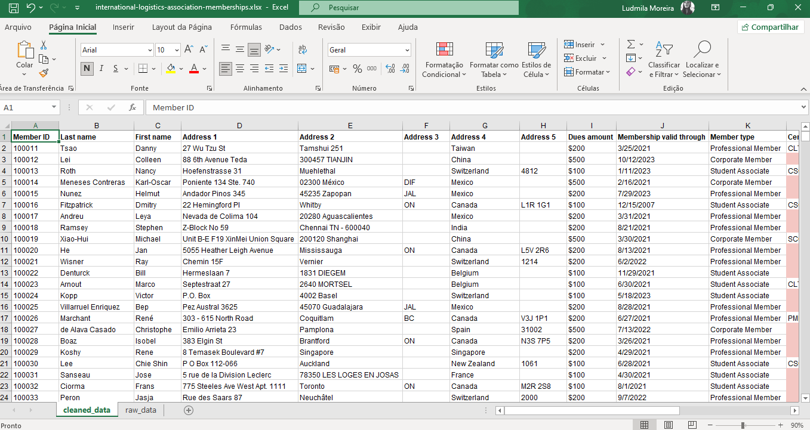

## Projeto de Limpeza de Dados no Google Sheets

### Descrição
Este projeto foi desenvolvido com o objetivo de praticar técnicas de limpeza, organização e padronização de dados utilizando Google Sheets.

Durante a atividade, foram aplicados processos fundamentais de preparação de dados para análise, incluindo identificação de células vazias, remoção de duplicatas, padronização de datas e separação de dados em colunas.

✨ ───────────── ✨

### Demonstração
Processo de limpeza e organização dos dados realizado no Google Sheets.



### Fluxo
1. Identificação de células vazias   
2. Aplicação de formatação condicional   
3. Remoção de registros duplicados   
4. Padronização de datas   
5. Divisão de texto em colunas  
6. Correção de números armazenados como texto 

✨ ───────────── ✨

### Tecnologias
- Google Sheets
- Ferramentas de limpeza de dados
- Formatação e manipulação de planilhas

✨ ───────────── ✨

### Técnicas utilizadas
- Formatação condicional
- Remoção de duplicatas
- Padronização de datas
- Divisão de texto em colunas
- Correção de números armazenados como texto
- Organização de dados
- Limpeza de inconsistências
- Preparação de dados para análise

✨ ───────────── ✨

### Como executar

1. Abra os arquivos `.xlsx` ou a planilha no Google Sheets  
2. Aplique a formatação condicional para identificar células vazias  
3. Utilize a ferramenta de remoção de duplicatas  
4. Padronize os formatos de data  
5. Utilize “Dividir texto em colunas” para separar informações  
6. Salve a versão final da planilha limpa

✨ ───────────── ✨

### Estrutura do projeto

```bash
google-sheets-data-cleaning/
│
├── international-logistics-association-memberships.xlsx
├── cosmetics-inc-data-cleaning.xlsx
├── demo.png
├── README.md
└── .gitignore
```
✨ ───────────── ✨

### Observações
Este projeto foi desenvolvido como prática de limpeza e preparação de dados
O processo foi realizado utilizando Google Sheets
Foram utilizadas ferramentas nativas da plataforma para tratamento de dados
A atividade reforça conceitos essenciais de Data Cleaning
O projeto demonstra técnicas importantes para preparação de dados em análises futuras

✨ ───────────── ✨

### Possíveis melhorias
Automatização do processo com Python
Criação de dashboards no Power BI
Integração com bancos de dados
Aplicação de validação de dados
Automação utilizando scripts
Desenvolvimento de pipeline ETL simples

✨ ───────────── ✨

### Sobre mim

Ludmila Alves Moreira

💻 Estudante de Tecnologia

🔗 Linkedin: [linkedin.com/in/ludmilasevla](https://linkedin.com/in/ludmilasevla)

🔗 Github: [github.com/ludmilasevla](https://github.com/ludmilasevla)

Este projeto foi desenvolvido como prática de Data Cleaning utilizando Google Sheets, com foco em organização, padronização e tratamento de dados. Durante a atividade, trabalhei habilidades importantes para análise de dados, como identificação de inconsistências, limpeza de registros e preparação de informações para futuras análises e visualizações.
